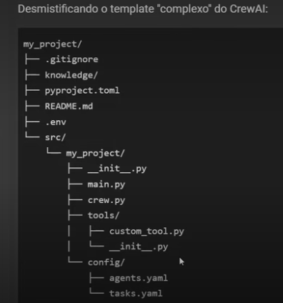
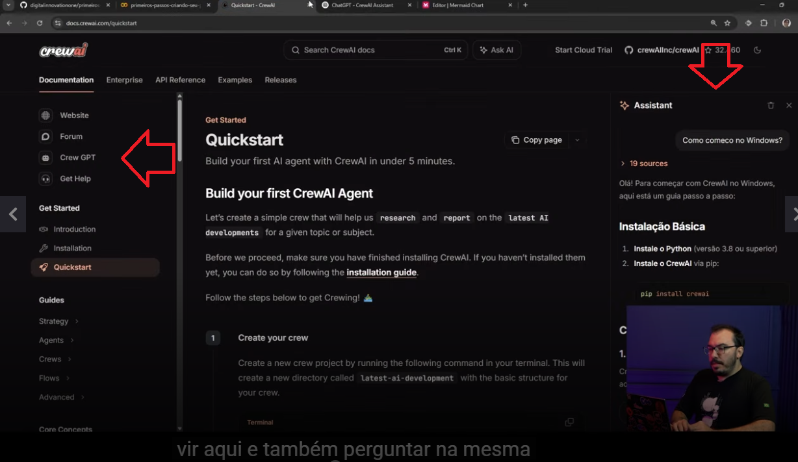

# CrewAI requisites

- Python (at least the version 3.10);
- All the populars operational systems (MacOS, Windows and Linux) are supported;
- The API key of the remote LLM if you wanna use a remote LLM.


# Installation

```sh
pip install crewai
```

**OBS:** [the documentation](https://docs.crewai.com/v1.15.10/pt-BR/installation) recommends another way to install CrewAI.

Extra tools:

```sh
pip install crewai-tools
```

Official command to CrewAI project creation:

```sh
crewai create crew <project-name>
```

**OBS:**

- This command also allow you to select a template;
- You have to remember that you do noot need this command if you don't wanna use it;
- You also must remember to access [the official documentation](https://docs.crewai.com/) when necessary;
- Is possible to use Google Collab.


# DIO documentation repository

Teacher said that we can access [this repository](https://github.com/digitalinnovationone/primeiros-passos-criando-seu-primeiro-agente-com-crewai) to see the documentation elaborated by them about this topic.


# CrewAI structure explained by the teacher

At least in the epoch of the course CrewAI created this structure when creating the project (`crewai create crew <crew-name>` command):




# Using the agents

Teacher remembered us that we can use the AI tools provided by CrewAI to help us:

