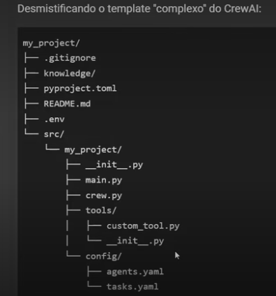
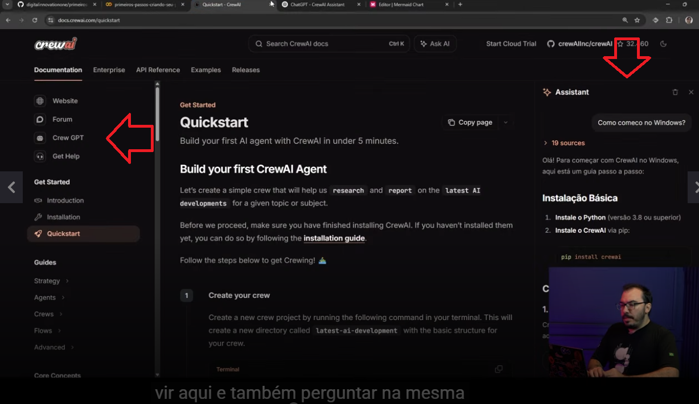
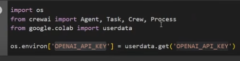
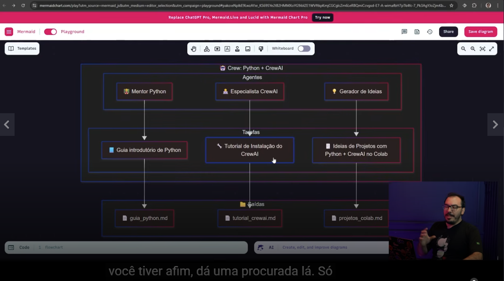
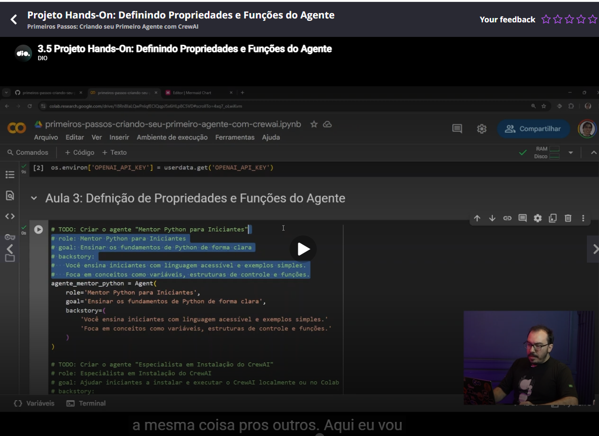
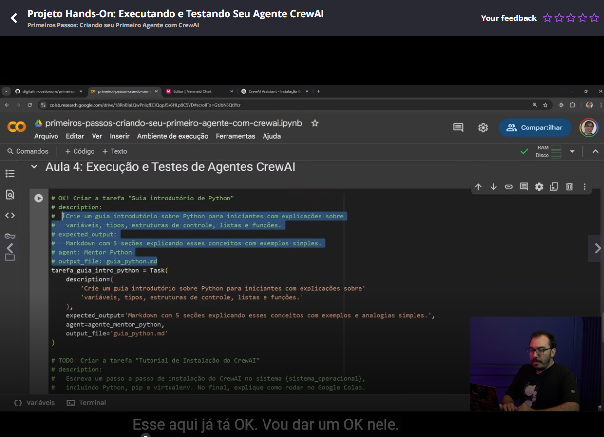

# CrewAI requisites

- Python (at least the version 3.10);
- All the populars operational systems (MacOS, Windows and Linux) are supported;
- The API key of the remote LLM if you wanna use a remote LLM.


# Installation

```sh
pip install crewai
```

**OBS:** [the documentation](https://docs.crewai.com/v1.15.10/pt-BR/installation) recommends another way to install CrewAI.

Extra tools:

```sh
pip install crewai-tools
```

Official command to CrewAI project creation:

```sh
crewai create crew <project-name>
```

**OBS:**

- This command also allow you to select a template;
- You have to remember that you do noot need this command if you don't wanna use it;
- You also must remember to access [the official documentation](https://docs.crewai.com/) when necessary;
- Is possible to use Google Collab.


# DIO documentation repository

Teacher said that we can access [this repository](https://github.com/digitalinnovationone/primeiros-passos-criando-seu-primeiro-agente-com-crewai) to see the documentation elaborated by them about this topic.


# CrewAI structure explained by the teacher

At least in the epoch of the course CrewAI created this structure when creating the project (`crewai create crew <crew-name>` command):




# Using the agents

Teacher remembered us that we can use the AI tools provided by CrewAI to help us:




# A small code to test the CrewAI installation



**OBS: teacher ran this code before run `crewai create crew <project-name>`.**


# Crew that will be created by the teacher in the course




# Important parts of an agent

- **Role**: motivation ou speciality of the agent in the team. In a simple phrase: "who the agent is". Examples are researcher, financial analyst, financial manager, a creative writer;
- **Goal**: main objective, mission. In a simple phrase: "what he wanna reach". Examples: to create an interesting report based on data, to generate innovative ideas;
- **Backstory: optional, but imoprtant**. Useful to the agent to have a personality, know where he is. Examples: you are an experience researcher that is known by find relevant information quickly, you are a meticulous analyst with an eye for complex data.


# Additional properties of an agent

- Tools: you can provide aditional tools for the agent, calculators or APIs are examples;
- Memory (of past occurrations);
- The capability of to delegate tasks to other agents;
- Is possible to adjust the verbosity of the agent.


# Tasks done in the teacher example

Teacher said that he will use Google Colab. But, indepenent of this question, see that teacher didn't use a "special strange file". Istead, he typed the code of the agent:



Using the same idea teacher coded the tasks. Example:



**Please note that the teacher is coding the idea passed in this next graph and that I passing in the previous paragraphs only examples of one agent and one task, not three.**


# Simple script to test the knowlegde passed by the teacher

To test my understanding of the concepts passed by the teacher in the course and to put in script **only the more important things**,  I created [this](https://colab.research.google.com/drive/1t3uKLT2hVl0v1sHMB--cU_QqL7Wu0cyk) script In Google Colab:

```Python
!pip install crewai
from google.colab import userdata
import os
from crewai import Agent, Task, Crew, Process

os.environ['OPENAI_API_KEY'] = userdata.get('OPENAI_API_KEY')

agent_verificacao_pontuacao = Agent(
    role = "Calcular o número de pontos do time baseado em alguns resultados de jogos",
    goal = "Retornar o número de pontos do Corinthians",
    backstory = "Vitória vale 9 pontos, empate vale 1 ponto e derrota vale 0 pontos"
)

task_analisar_resultados_jogos = Task(
    description = "Jogo 1: Corinthians 3 x 0 Palmeiras \n" +
                "Jogo 2: Corinthians 2 x 1 Sum Paulu \n" +
                "Jogo 3: Corinthians 2 x 2 Portuguesa \n" +
                "Jogo 4: Corinthians 0 x 2 Mirassol \n" +
                "Jogo 5: Corinthians 1 x 0 Santus \n",   
    agent = agent_verificacao_pontuacao,
    input = "resultados de jogos",
    expected_output = "número de pontos"             
)

equipe = Crew(
    agents = [agent_verificacao_pontuacao],
    tasks = [task_analisar_resultados_jogos],
    process = Process.sequential
)

resultado = await equipe.kickoff_async()
  print(resultado)
```